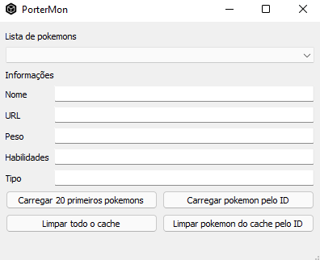

# PorterMon

PorterMon é uma aplicação para a consulta e exibição de informações de um pokemon, os dados são acessados através
da [PokéAPI](https://pokeapi.co/docs/v2)

## Dependências

* [PyQt5](https://pypi.org/project/PyQt5/)

* [requests](https://pypi.org/project/requests/)

A instalação das dependências pode ser realizada exectutando o comando abaixo:

`pip install -r requirements.txt`

## Funcionamento

Conforme recomendado na documentação da [PokéAPI](https://pokeapi.co/docs/v2) o PorterMon faz o cache dos dados dos
pokemons, no projeto foi utilizado um banco de dados [sqlite](https://sqlite.org/index.html).

A requisição para a API é feita com o pacote [requests](https://pypi.org/project/requests/) caso não tenha armazenado no
banco de dados as informações do pokemon que foi consultado.

## Execução

Para executar a aplicação é necessário rodar o comando:

`python main.py`

## Utilização

### Interface

A interface apresenta uma lista com os pokemons que já foram consultados, que logo abaixo contém um formulário para a
exibição dos dados do pokemon selecionado. 

Também são apresentados 4 botões, os quais tem como funcionalidade a limpeza
do cache(armazenamento no banco de dados) e a consulta dos primeiros 20 pokemons ordenados pelo seu número na pokedex e
também para a consulta por um número específico da pokedex.
